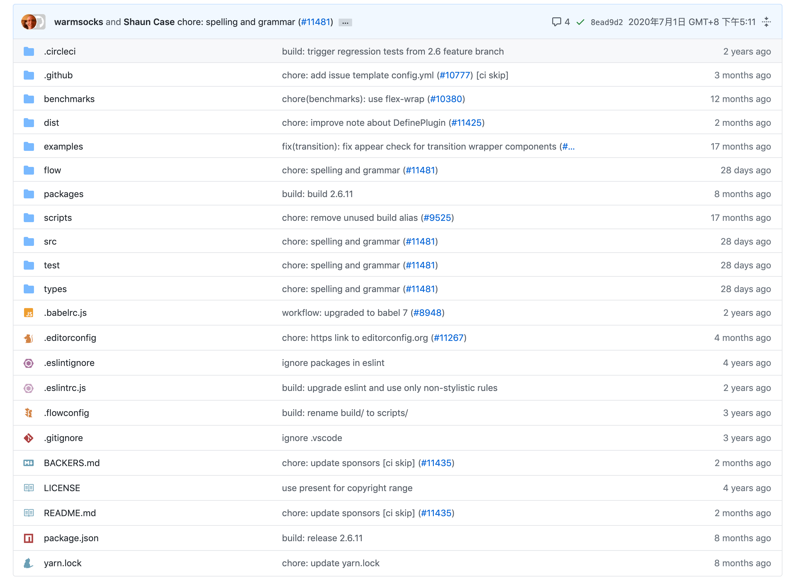

# github-file-icon

> fork from  [github-file-icon extension](https://github.com/homerchen19/github-file-icon)

A userscript change the github default file icon to the [file-icons/atom](https://github.com/file-icons/atom);

## Install

1. Required tampermonkey [Tampermonkey](https://www.tampermonkey.net/index.php)

2. Install script: [Greasyfork](https://greasyfork.org/zh-CN/scripts/405969-github-custom-styles)

## Preview

preview:

